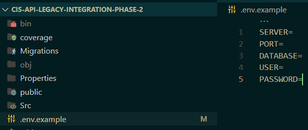

# cis-api-legacy-integration-phase-2

In this phase, the focus is on implementing the Crowdsourced Ideation Solution (CIS) API, which extends the functionality established in Phase 1.

 This phase aims to develop and integrate a modern API for the CIS platform, allowing users to create topics, submit ideas, and vote on them. The solution must seamlessly interact with the legacy system via the user API created in Phase 1; the primary goal is to ensure that the CIS API is robust, functional, and aligned with the overall project objectives while providing a user-friendly interface for interacting with topics and ideas.


## Prerequisites

- Set up enviroment variables to the project. There is an example of how your `.env` file must be:



Set these env variables in a `.env` from root.

- Launch `users-api` and take in count is running in the same port of phase 2 (8080 by default):

**Phase 1 run information**


**Phase 2 endpoint consumption for phase 1**


# Launch Phase 2

Install dependencies
```
dotnet restore
```
Update database schema
```
dotnet ef database update
```
Build the app
```
dotnet build
```
Launch app
```
dotnet run
```

**Swagger url**
```
http://localhost:5141/swagger/index.html
```